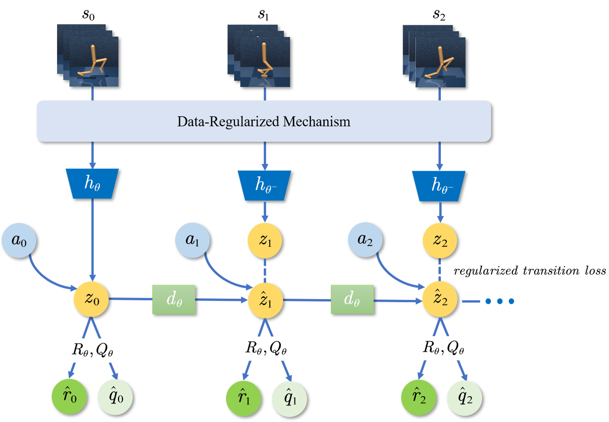
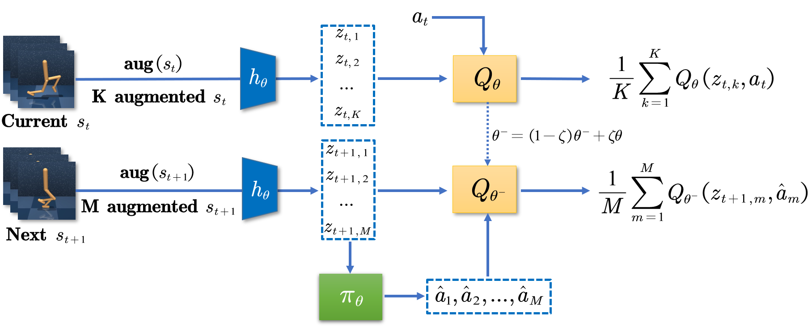
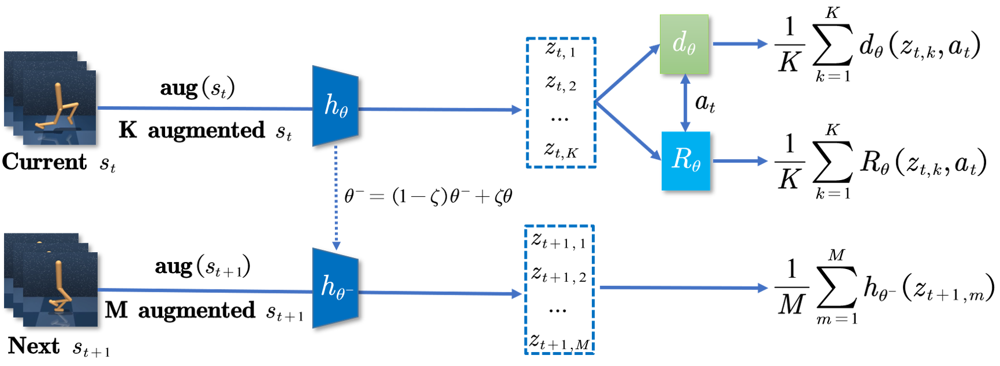

# Regularizing Model Predictive Control for Pixel-based Long-Horizon Tasks

Original PyTorch implementation of **RMPC**.


## Abstract

Planning has been proven to be an effective strategy for handling complex tasks in environments with well-established models. However, it still remains a challenge to plan for pixel-based long horizon tasks with limited samples due to the constraints of computational budget and the accumulated model biases. In this study, a **R**egularized **M**odel **P**redictive **C**ontrol (**RMPC**) model is proposed, which combines the advantages of model-based reinforcement learning and model-free learning via temporal learning. **RMPC** takes full advantage of the limited samples to update the generated environment model and the estimation of long-term value iteratively. Additionally, an implicit Data-Regularized mechanism is employed to improve the robustness of the generated environment model and reliability of the value function estimation. To evaluate the proposed **RMPC**, extensive comparison experiments and ablation studies are performed on the benchmark datasets. The empirical results show that **RMPC** demonstrates superior sample-efficiency and more stable performance on pixel-based continuous control tasks from DMControl, surpassing previous model-based and model-free algorithms.

<p align="center">
  
</p>


<p align="center">
  
</p>

<p align="center">
  
</p>


## Instructions

Assuming that you already have [MuJoCo](http://www.mujoco.org) installed, install dependencies using `conda`:

```
conda env create -f environment.yaml
conda activate RMPC
```

After installing dependencies, you can train an agent by calling

```
python src/train.py task=walker-run
```

Evaluation videos and model weights can be saved with arguments `save_video=True` and `save_model=True`. Refer to the `cfgs` directory for a full list of options and default hyperparameters.

The training script supports both local logging as well as cloud-based logging with [Weights & Biases](https://wandb.ai). To use W&B, provide a key by setting the environment variable `WANDB_API_KEY=<YOUR_KEY>` and add your W&B project and entity details to `cfgs/default.yaml`.


## Evaluate videos
We also provide results of evaluation videos of three demos: Cartpolt-Swingup, Cheetah-Run, Walker-Walk
<video src='https://user-images.githubusercontent.com/86116315/205427034-efd3c43a-9558-4ce9-8d2a-bb23957b4c7b.mp4)'></video>
<video src='https://user-images.githubusercontent.com/86116315/205427179-130cc94d-f3bf-47ac-b41d-1beccc3d4538.mp4'></video>
<video src='https://user-images.githubusercontent.com/86116315/205427231-9f21cc27-a0c3-4edc-b523-0b225823becf.mp4'></video>


## License & Acknowledgements

RMPC is licensed under the MIT license. [MuJoCo](https://github.com/deepmind/mujoco) and [DeepMind Control Suite](https://github.com/deepmind/dm_control) are licensed under the Apache 2.0 license. We thank the [DrQv2](https://github.com/facebookresearch/drqv2) and [TD-MPC](https://nicklashansen.github.io/td-mpc) authors for their implementation of DMControl wrappers.
